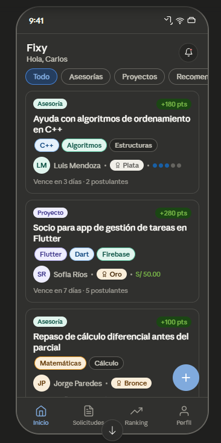
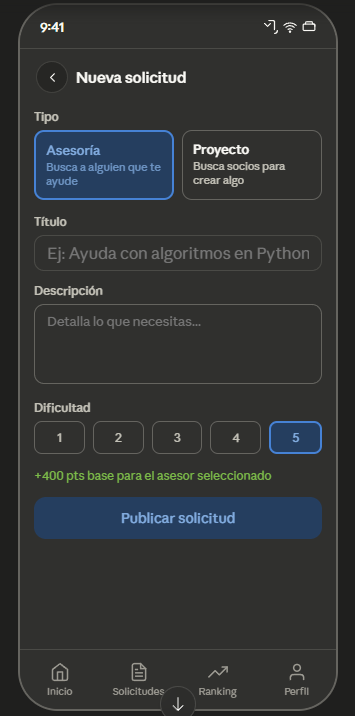
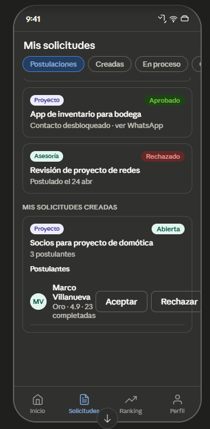
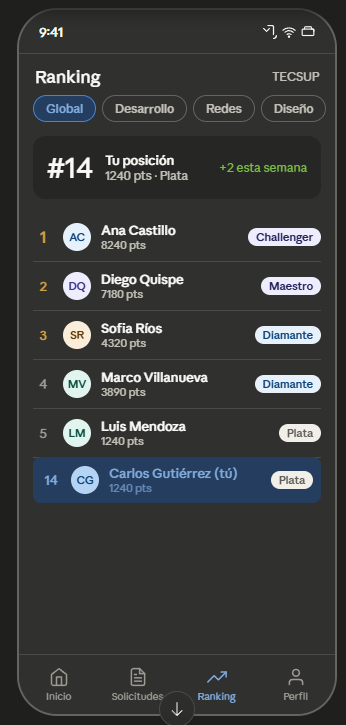
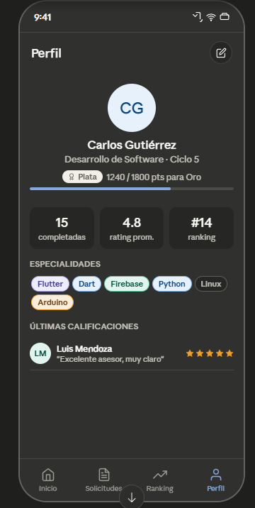
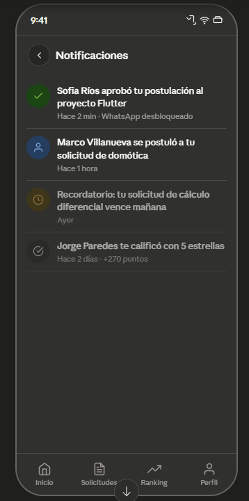

<div align="center">


# Fixy

**Asesorías y proyectos para estudiantes Tecsup.**

Plataforma móvil que conecta estudiantes para resolver necesidades académicas mediante asesorías y colaboración en proyectos, con un sistema de reputación gamificado por puntos y medallas.

[](https://flutter.dev)
[](https://dart.dev)
[](https://supabase.com)
[](https://m3.material.io)
[]()
[](https://github.com/Fixy-tec/fixy-flutter/releases)

</div>

---

## 📑 Tabla de contenidos

- [Acerca del proyecto](#-acerca-del-proyecto)
- [Características](#-características)
- [Stack tecnológico](#-stack-tecnológico)
- [Capturas](#-capturas)
- [Sistema de reputación](#-sistema-de-reputación)
- [Quick start](#-quick-start)
- [Estructura del proyecto](#-estructura-del-proyecto)
- [Branding](#-branding)
- [Roadmap](#️-roadmap)
- [Licencia](#-licencia)

---

## 🎯 Acerca del proyecto

**Fixy** es una app móvil multiplataforma (Android + iOS) diseñada como proyecto final del curso **Aplicaciones Móviles Multiplataforma — Tecsup 2026-1**. Permite a estudiantes de Tecsup publicar dos tipos de solicitudes:

- 🎓 **Asesorías** — buscar a alguien que ayude con un curso, tema o proyecto
- 🤝 **Proyectos** — buscar socios para desarrollar algo en conjunto

Otros estudiantes pueden postular, el creador selecciona, se desbloquea el contacto por WhatsApp y al finalizar ambas partes se califican mutuamente, ganando puntos para subir de medalla al estilo *League of Legends*.

---

## ✨ Características

### Autenticación
- Registro con email institucional `@tecsup.edu.pe` (validado en cliente, en `CHECK constraint` y en trigger)
- Persistencia de sesión vía Supabase Auth con flow PKCE

### Solicitudes
- Feed con filtros: **Todo**, **Asesorías**, **Proyectos**, **Recomendados** (intersección de tags)
- Crear con tipo, dificultad 1-5, tags, beneficio S/, fecha límite, cantidad de participantes
- **Cancelar** o **eliminar** solicitudes propias antes de tener postulantes
- Pull-to-refresh y empty/error states pulidos

### Postulaciones
- Postularse con mensaje de presentación (300 chars máx)
- Vista del creador con lista de postulantes (medalla, rating, mensaje)
- Aprobar / rechazar / **retirar** postulación
- Una sola postulación aprobada por solicitud (validado en trigger SQL)

### WhatsApp
- Al aprobar postulante, se desbloquea el número del otro
- Botón "Abrir WhatsApp" usa `wa.me/` con `url_launcher`

### Calificaciones
- Modal con 5 estrellas y comentario opcional (200 chars)
- Modificadores en vivo: **5★ ×1.5** · **4★ ×1.2** · **3★ base** · **2★ −30** · **1★ −80**
- Trigger SQL aplica los puntos automáticamente y dispara cambio de medalla

### Perfil
- Propio editable: bio, carrera, ciclo, portfolio, LinkedIn, WhatsApp, especialidades
- Público de cualquier usuario (read-only) con todos sus stats
- Progreso visual a la siguiente medalla

### Ranking
- Tabla de líderes global y por área (Flutter, Redes, Matemáticas, etc.)
- Tu posición + delta semanal + medalla
- Podio con colores oro/plata/bronce

### Notificaciones
- In-app con **realtime de Supabase** (badge en vivo en la campana del feed)
- 7 tipos: nueva postulación, aprobada, rechazada, completada, tag-match, recordatorio, cambio de medalla
- Marcar leídas individualmente o todas; tap navega al request relacionado

### Cron jobs (pg_cron)
- **Auto-rating de 3★** tras 7 días sin calificar (no bloquea el flujo)
- **Recordatorio de fecha límite** 24h antes

---

## 🛠 Stack tecnológico

| Capa | Tecnología |
|---|---|
| **UI Framework** | Flutter 3.41+ / Dart 3.11+ con Material 3 |
| **Backend** | Supabase (Auth + Postgres + Realtime + RLS + pg_cron) |
| **State management** | flutter_riverpod 2.x |
| **Routing** | go_router 14.x con `StatefulShellRoute` |
| **Modelos** | freezed + json_serializable (codegen) |
| **HTTP/SDK** | supabase_flutter (cliente oficial) |
| **Tipografía** | Google Fonts (Inter) |
| **Localización** | intl con locale español |
| **Otros** | url_launcher, flutter_dotenv, cached_network_image |

> **Decisión de diseño**: la lógica crítica de reputación (cálculo de puntos, cambio de medalla, auto-rating, validaciones de negocio) vive en **triggers SQL con `SECURITY DEFINER`**, no en Dart. Esto evita que un cliente malicioso manipule la reputación.

---

## 📱 Capturas

| Login | Feed | Crear solicitud |
|---|---|---|
|  |  |  |

| Mis solicitudes | Ranking | Perfil | Notificaciones |
|---|---|---|---|
|  |  |  |  |

> Las imágenes corresponden al prototipo inicial. La implementación real respeta la estructura y mejora el diseño con Material 3.

---

## 🏆 Sistema de reputación

### Puntos base por dificultad

| Dificultad | Puntos base |
|:-:|:-:|
| 1 | +50 |
| 2 | +100 |
| 3 | +180 |
| 4 | +280 |
| 5 | +400 |

### Modificadores por calificación recibida

| ⭐ | Efecto |
|:-:|---|
| 5 | ×1.5 (bonus +50%) |
| 4 | ×1.2 (bonus +20%) |
| 3 | ×1.0 (base) |
| 2 | −30 pts fijos |
| 1 | −80 pts fijos |

### Medallas

| Medalla | Rango |
|---|---|
| 🛡️ Hierro | 0 – 299 |
| 🥉 Bronce | 300 – 799 |
| 🥈 Plata | 800 – 1799 |
| 🥇 Oro | 1800 – 3499 |
| 💎 Diamante | 3500 – 5999 |
| 👑 Maestro | 6000 – 9999 |
| ⚔️ Challenger | 10000+ |

> Las medallas pueden **bajar** si el usuario acumula penalizaciones, igual que en LoL/Valorant.

---

## 🚀 Quick start

### Prerrequisitos

- Flutter 3.41+
- Dart 3.11+
- Cuenta gratis en [supabase.com](https://supabase.com)
- Android Studio o VS Code con extensión Flutter

### 1. Clonar e instalar

```bash
git clone https://github.com/Fixy-tec/fixy-flutter.git
cd fixy-flutter
flutter pub get
dart run build_runner build --delete-conflicting-outputs
```

### 2. Configurar Supabase

1. Crea un proyecto en [supabase.com](https://supabase.com).
2. **SQL Editor** → ejecuta los archivos de [`supabase/migrations/`](supabase/migrations/) en orden:
   1. `01_schema.sql` — tablas + enums (10 tablas)
   2. `02_functions.sql` — funciones de negocio
   3. `03_triggers.sql` — triggers automáticos
   4. `04_rls.sql` — Row Level Security
   5. `05_seed.sql` — catálogo de tags
   6. `06_seed_demo.sql` *(opcional)* — 5 usuarios + 8 solicitudes de demo
   7. `07_cron.sql` — jobs diarios (requiere `pg_cron`)
3. **Authentication → Providers → Email**: enable Email, desactivar "Confirm email" en desarrollo.
4. **Database → Extensions**: habilitar `pg_cron`.
5. **Database → Replication**: habilitar Realtime en `notifications`, `applications`, `requests`.

> Pasos detallados en [`supabase/README.md`](supabase/README.md).

### 3. Configurar variables de entorno

```bash
cp .env.example .env
```

Y reemplaza con los valores de **Project Settings → API** en Supabase:

```env
SUPABASE_URL=https://xxxxxxxxxxxxx.supabase.co
SUPABASE_ANON_KEY=eyJhbGc...
```

### 4. Generar íconos del launcher (opcional)

```bash
dart run flutter_launcher_icons
```

### 5. Correr la app

```bash
flutter run
```

#### Usuarios demo

Si aplicaste `06_seed_demo.sql`, puedes iniciar sesión con:

| Email | Contraseña | Medalla |
|---|---|---|
| `sofia.rios@tecsup.edu.pe` | `fixy12345` | Diamante |
| `ana.castillo@tecsup.edu.pe` | `fixy12345` | Maestro |
| `marco.villanueva@tecsup.edu.pe` | `fixy12345` | Diamante |
| `luis.mendoza@tecsup.edu.pe` | `fixy12345` | Plata |
| `jorge.paredes@tecsup.edu.pe` | `fixy12345` | Bronce |

---

## 📂 Estructura del proyecto

```
fixy-flutter/
├── lib/
│   ├── core/
│   │   ├── theme/        # AppColors + AppTheme M3
│   │   ├── router/       # go_router + AppShell
│   │   ├── supabase/     # cliente singleton
│   │   ├── constants/    # reputation.dart (espejo UI de SQL)
│   │   └── utils/        # validators, time_ago, whatsapp_launcher
│   ├── features/
│   │   ├── auth/         # login, registro, sesión
│   │   ├── feed/         # inicio con filtros + realtime
│   │   ├── requests/     # crear + mis solicitudes (4 tabs)
│   │   ├── applications/ # detalle + postular + aprobar
│   │   ├── ratings/      # calificaciones (5 estrellas)
│   │   ├── profile/      # propio editable + público read-only
│   │   ├── ranking/      # tabla de líderes con filtros
│   │   └── notifications/# stream realtime
│   ├── shared/
│   │   ├── widgets/      # MedalBadge, TagChip, RequestCard, EmptyState
│   │   └── models/       # entidades freezed compartidas
│   ├── app.dart
│   └── main.dart
├── supabase/
│   ├── migrations/       # 7 SQL files (idempotentes, en orden)
│   └── README.md
├── assets/
│   ├── logo.png          # logo wordmark con fondo transparente
│   └── icon_foreground.png # mascota Fixo para launcher
├── android/ ios/
└── pubspec.yaml
```

> **Convención**: estructura por features, capas (`data/domain/presentation`) solo cuando aportan valor. Riverpod para DI; Supabase Auth maneja sesión.

---

## 🎨 Branding

### Paleta

| Color | Hex | Uso |
|---|---|---|
| 🔵 Primary | `#1A4CA3` | Branding, botones primarios, "Abierta" |
| 🟢 Secondary | `#057F78` | Acentos, "En proceso" |
| 🟢 Points positive | `#34A29B` | Puntos ganados, montos S/ |
| 🔴 Points negative | `#D64545` | Puntos perdidos, "Rechazado" |
| 🟡 Warning | `#E6B800` | "Pendiente", recordatorios |

Toda la UI usa `ColorScheme.fromSeed(#1A4CA3)` para cohesión Material 3 en modo claro y oscuro.

### Logo

El logo es un birrete de graduación con flecha hacia arriba (símbolo de progreso académico), en gradiente brand. La mascota es **Fixo**, un robot estudiante usado como icono del launcher con fondo `#1A4CA3`.

---

## 🛣️ Roadmap

Implementado en v1.0.0:

- [x] Autenticación con email Tecsup
- [x] Feed con filtros + recomendados
- [x] Crear / cancelar / eliminar solicitudes
- [x] Postulaciones con aprobar / rechazar / retirar
- [x] WhatsApp deeplink
- [x] Sistema de calificaciones mutuas
- [x] Medallas Hierro → Challenger con cambios automáticos
- [x] Ranking global y por área
- [x] Perfil propio + público
- [x] Notificaciones in-app realtime
- [x] Cron jobs (auto-rating + deadline reminders)

Backlog para futuras versiones:

- [ ] Sistema de pagos integrado (Yape/Plin/Stripe)
- [ ] Multi-institución (UCSM, UCSP, UNSA)
- [ ] Verificación de identidad con carnet
- [ ] Filtros avanzados de búsqueda
- [ ] Reportes de usuarios + moderación
- [ ] Insignias por logros (no solo medallas por puntos)
- [ ] Notificaciones push (FCM)

---

## 📜 Licencia

Proyecto académico para Tecsup 2026-1. Uso educativo.

---

<div align="center">

Hecho con 💙 en Arequipa, Perú

</div>
